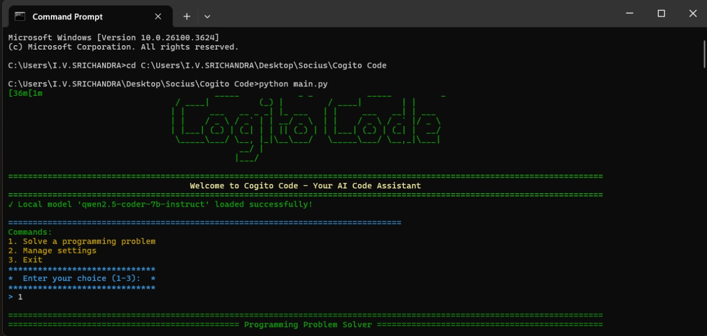
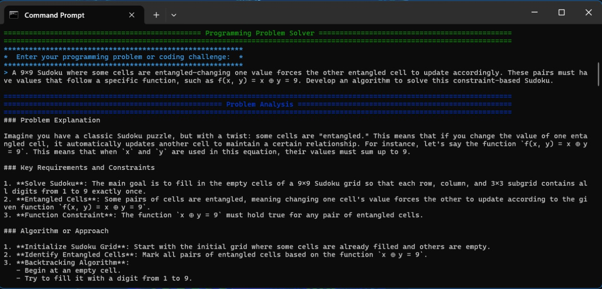
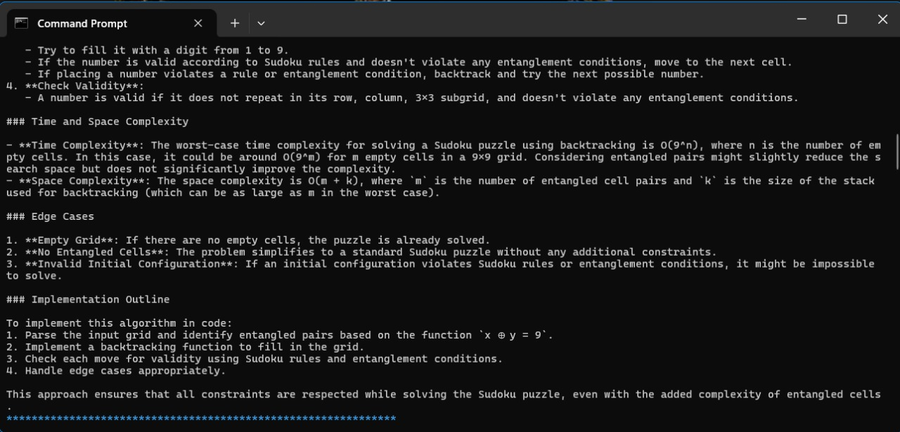
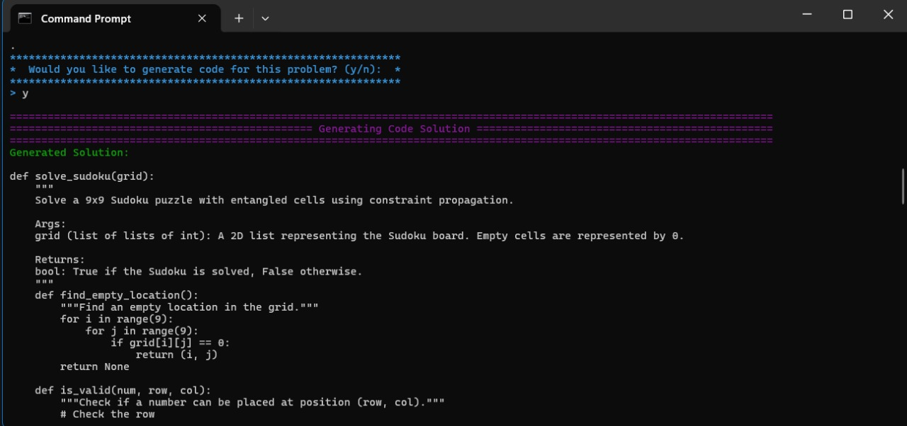
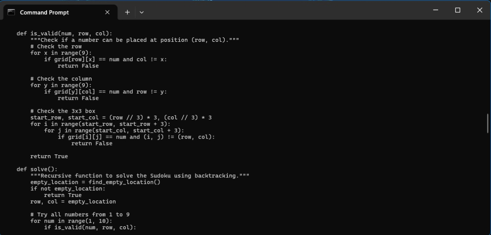
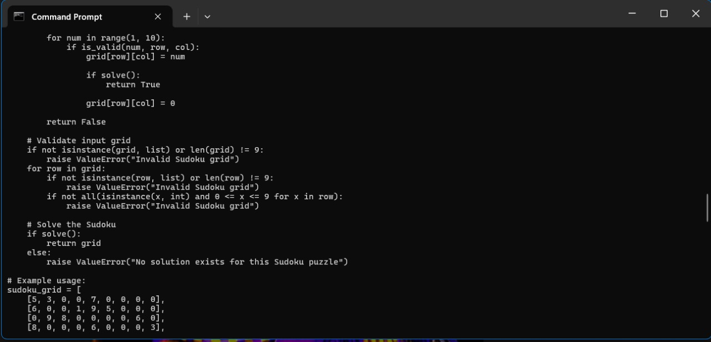
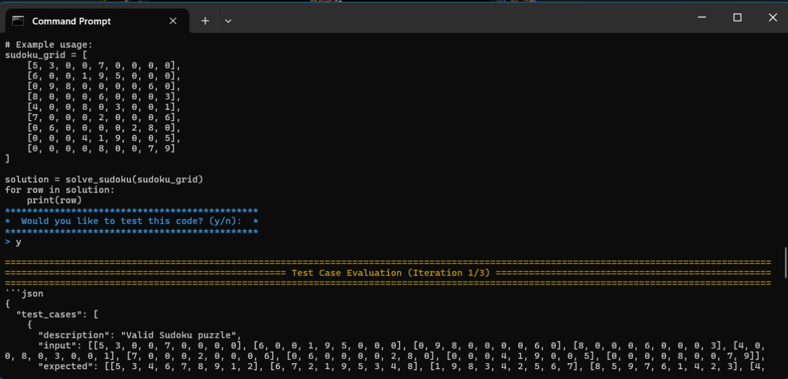
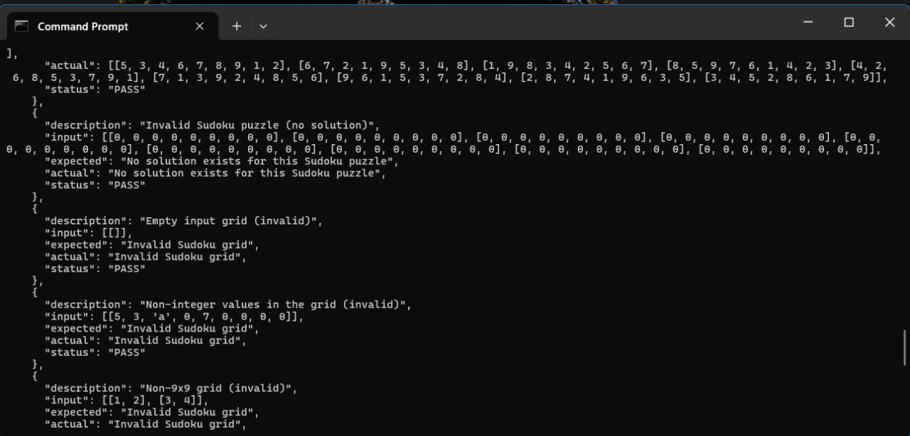
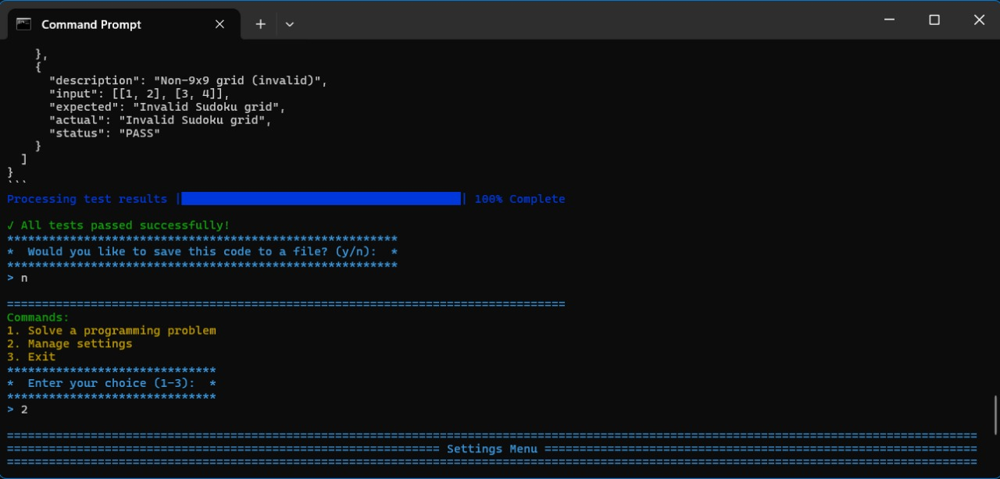
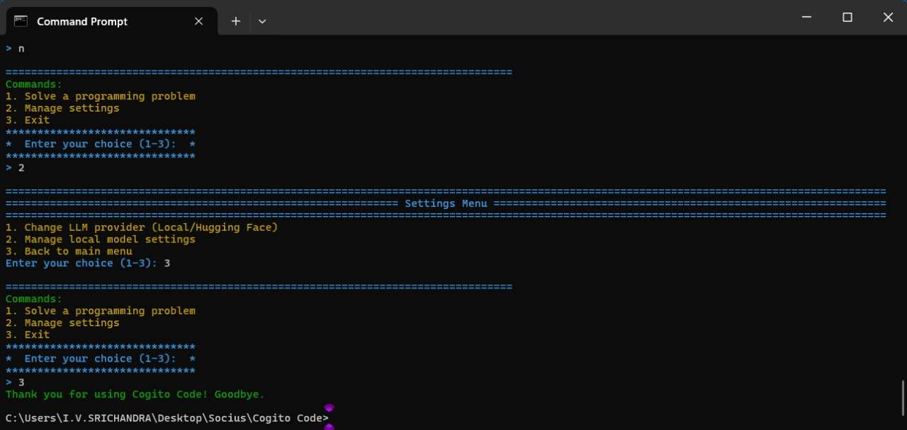

<p align="center">
  
</p>

# 🌟 Cogito Code: Your AI Coding Assistant 🌟

Cogito Code is a cutting-edge, interactive application designed to revolutionize how you approach coding challenges and problem-solving. Whether you’re a coding enthusiast, software engineer, or educator, this tool is your go-to companion for generating efficient, well-structured, and tested code solutions.

---

## 🔍 What is Cogito Code?

Cogito Code is a versatile platform that helps you:
- Generate optimal and clean code for any programming problem.
- Understand and break down complex problem statements with detailed explanations.
- Automatically create and run test cases to ensure code robustness.
- Save and manage your coding progress with ease.

---

## 🌟 Key Functionalities

1. **🧠 Code Generation**  
   - Generates optimal and clean code for any programming challenge.
  

2. **📝 Problem Understanding**  
   - Provides detailed breakdowns of programming problems.


3. **🧪 Code Testing**  
   - Automatically generates test cases to validate your code.
   - Identifies edge cases and ensures robust solutions.

4. **💾 Save & Manage Code**  
   - Save your generated code to your local system effortlessly.
   - Organize your projects and track your progress efficiently.

5. **⚙️ Flexible Model Selection**  
   - Choose between a Local LLM (via LM Studio) or Hugging Face models.
   - Seamlessly switch between model providers based on your needs.

---

## 👥 Who can Use This Application?

- **Programmers and Developers:**  
  Quickly generate and validate code solutions.

- **Educators and Mentors:**  
  Create interactive problem solutions and teaching materials.

- **Students and Learners:**  
  Practice coding challenges with AI assistance and automated testing.

---

## 🌱 Benefits for Users

- **💡 Efficiency:**  
  Spend less time debugging and more time innovating.

- **🚀 Productivity:**  
  Generate ready-to-use code snippets with minimal effort.

- **🧩 Learning:**  
  Gain insights into complex coding challenges and learn from the generated solutions.

- **🌐 Flexibility:**  
  Use local or cloud-based models according to your setup.

- **🧠 Problem Solving:**  
  Benefit from AI-driven analysis to overcome coding obstacles.

---

## 🛠️ Frameworks & Packages Used

### Python Libraries
- **`lmstudio` 🧠:** Interfaces with Local Language Models.
- **`huggingface-hub` 🌐:** Provides access to models from Hugging Face.
- **`colorama` 🎨:** Adds colorful, styled console outputs.
- **`pyfiglet` 💡:** Generates ASCII art for stylish headers.
- **`tqdm` 📊:** Displays progress bars for an enhanced user experience.


### Custom Modules
- **UI Elements:** Enhances user interactions with formatted outputs.
- **Helper Functions:** Manages code extraction, test result analysis, and problem breakdowns.
- **Wrapper:** Handles interactions with models and settings management.

---

## 💡 Why Choose Cogito Code?

Cogito Code transforms how you tackle coding challenges by leveraging AI-driven solutions. Whether you need quick code generation, thorough testing, or insightful problem analysis, this application empowers you to **code smarter, not harder**!

---

## 🚀 Getting Started

### Installation

1. **Download LM Studio:**  
   Download LM Studio and select the model you want to use.

2. **Model Setup:**  
   Load the model into the server and copy the model card available in LM Studio. Paste it into the terminal when prompted.

### Running the Application

Run the application by executing the following command in your terminal:

```bash
python main.py
```
---

## 🎨 Sample Outputs

Below are some sample outputs from Cogito Code:

<table align="center">
  <tr>
    <td align="center">
      <br>
      Output 1
    </td>
    <td align="center">
      <br>
      Output 2
    </td>
  </tr>
  <tr>
    <td align="center">
      <br>
      Output 3
    </td>
    <td align="center">
      <br>
      Output 4
    </td>
  </tr>
  <tr>
    <td align="center">
      <br>
      Output 5
    </td>
    <td align="center">
      <br>
      Output 6
    </td>
  </tr>
  <tr>
    <td align="center">
      <br>
      Output 7
    </td>
    <td align="center">
      <br>
      Output 8
    </td>
  </tr>
  <tr>
    <td align="center">
      <br>
      Output 9
    </td>
    <td align="center">
      <br>
      Output 10
    </td>
  </tr>
</table>

